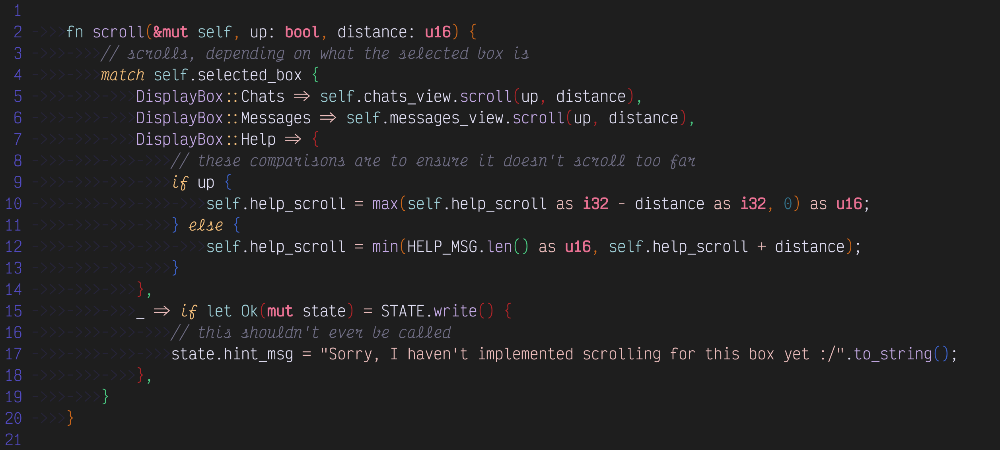

# Rosé Pine Vim Colorscheme

This is the rosé pine colorscheme turned into a dark and light vim colorscheme file. Place these files in `~/.vim/colors/` (or `~/.config/nvim/colors` if you are using neovim) and source them with `:colorscheme rose-pine-{dark,light}`.

Rosé Pine Dark theme on sample rust code

Rosé Pine Light theme on the same sample rust code
